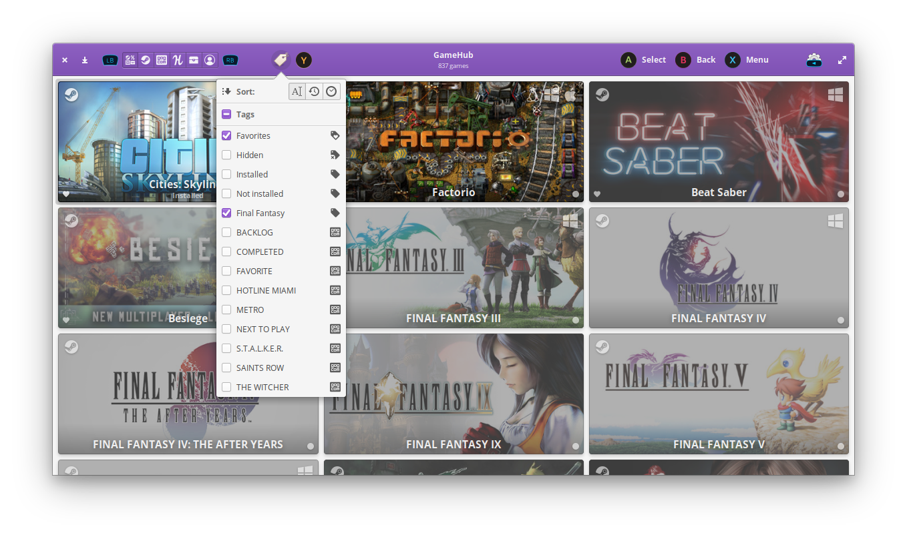

# GameHub Launcher for Kodi

[Kodi](http://kodi.tv) addon to launch the [GameHub](https://tkashkin.tk/projects/gamehub/) application.



## Features

- Launch GameHub from Kodi

## Prerequisites

- [Install and setup GameHub](<https://github.com/tkashkin/GameHub/#installation>)

## Install from repository

1. Make sure that Unknown Sources is enabled in Settings → System → Add-ons

1. [Install solbero's Kodi add-on repository](https://github.com/solbero/repository.solbero/blob/master/README.md)

1. Visit Home → Settings → Add-ons → Install from repository → solbero’s Kodi add-on repository → Program Add-ons → GameHub → Install

## Install manually

1. [Download the latest version of the GameHub Kodi Launcher](https://github.com/solbero/plugin.gamehub/releases/latest)
1. Go to Settings → Add-ons → Install from zip file
1. Navigate to where you placed the zip file and select Install

## Troubleshooting

If GameHub is installed as an AppImage or flatpack application, you must specify the path to the application in the addon settings.

## Development

```bash
git clone git@github.com:solbero/plugin.gamehub.git ~/.kodi/addons/plugin.gamehub
cd ~/.kodi/addons/plugin.gamehub
git status
```

## About

- [solbero](https://github.com/solbero)
- [Source](https://github.com/RobLoach/lutris-kodi-addon)
